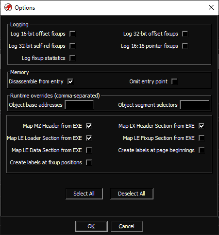
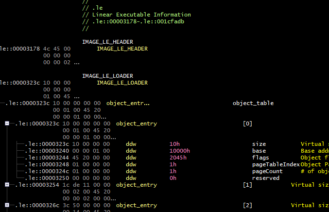
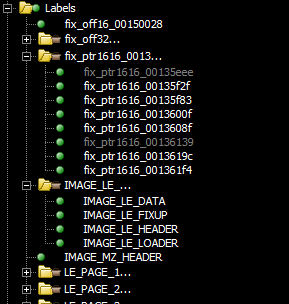

# Ghidra LX/LE Loader

This was orginally made and reworked for decompiling a specific 16 Bit DOS application that was used in the 90s. IDA is not able to read 16 Bit applications and many other tools didn't work aswell. Ghidra is the only disassembler/decompiler that had some results...

* Supports LE/LX files in various formats:
  * OS/2 LX-Style
  * MSDOS DOS/16 LE-Style
  * MSDOS DOS/4 LE-Style
  * DOS32A sb.exe unbound LE/LX-Style
  * Windows Virtual Device Driver (VxD)
* Full page-map and fixup (relocation) support
* Completely typed executable headers (and other image data) with comments

Optionally, various options can be specified individually for each file:

* Manually override the object base addresses and segment selectors (good for syncing with a debugger / DOSBox)
* Map various image data to an overlay:
  * Map MZ Header
  * Map LX Header
  * Map LX Loader Section
  * Map LX Fixup Section (fully typed!)
  * Map LX Data Section (i.e. the unmodified page data)
* Create labels for each fixup in memory
* Create labels for each page beginning in memory
* Log fixup statistics / Log individual fixup types

## Extra

